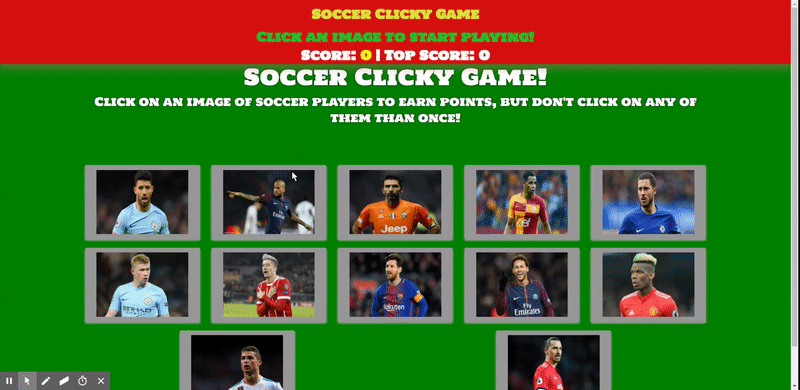

# Clicky-Game
A memory game with React.The goal here was to break up the application's UI into components, manage component state, and respond to user events.

* The application should render different images to the screen. Each image should listen for click events.
* The application should keep track of the user's score.
* The user's score should be reset to 0 if they click the same image more than once.

## A View From The Application

<strong><a href= "https://guarded-temple-44149.herokuapp.com/">Click Me To Try The Application

 

## Technologies Used

* React.js
* CSS
* Bootsrap